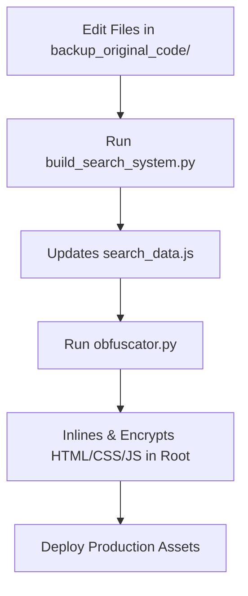

# 🚩 SFI West Bengal Web Portal

[](LICENSE)
[](#)
[](#)
[](#)
[](#)

A premium, offline-first, highly responsive, and security-obfuscated web portal built for the **Students' Federation of India (SFI) West Bengal State Committee**. This application serves as a comprehensive resource hub containing SFI history, committee information, publications, student booklets, news, press statements, and a dedicated database commemorating martyrs.

---

## 📖 Table of Contents
1. [Tech Stack](#-tech-stack)
2. [Key Features](#-key-features)
3. [Repository Directory Structure](#-repository-directory-structure)
4. [Build & Obfuscation Workflow](#-build--obfuscation-workflow)
5. [Developer Documentation](#-developer-documentation)
6. [Community Guidelines](#-community-guidelines)

---

## 🛠️ Tech Stack

| Layer | Technology | Purpose |
| :--- | :--- | :--- |
| **Frontend Layout** | HTML5, Bootstrap 5 | Standard structure and responsive grids |
| **Styling** | Vanilla CSS3 | Custom theme tokens, micro-animations, layout properties |
| **Dynamic Actions** | Vanilla JS (ES6) | Client-side search, theme toggle, particles, slider gestures |
| **Visual Effects** | Canvas API | Interactive mathematical vector background field |
| **Build Indexer** | Python 3 | Parses HTML pages and datasets to build the local search database |
| **Security Pipeline** | Python 3 | Inlines local assets and XOR-encrypts body payloads |

---

## ✨ Key Features

* **Interactive Vector Particles Field**: A custom HTML5 Canvas-based background grid that animates dynamically, responding to mouse proximity with repulsion and velocity-aligned line capsule rotation.
* **Dual Theme Engine**: Seamless dark and light themes using custom CSS variables (tokens) integrated with `localStorage` for state retention.
* **Instant Offline-First Search**: Local client-side search indexing that reads standard JSON-like script collections containing martyrs and press databases for fast queries.
* **Responsive Slider**: A lightweight touch-gesture slider for displaying announcements, complete with autoplay management and swipe events.
* **Layout Cryptography (Obfuscation)**: Security-focused compilation that protects original layouts and local stylesheets using XOR encryption and embedded self-decrypting runtime JS bootloaders.

---

## 📂 Repository Directory Structure

```text
├── .github/                       # GitHub Actions and workflows
├── backup_original_code/          # CRITICAL: Clean, readable source files (HTML, JS, CSS)
│   ├── about.html
│   ├── index.html
│   ├── martyrs_data.js            # Martyr database (JSON assignment)
│   ├── press_data.js              # Press release database (JSON assignment)
│   ├── script.js                  # Main frontend interaction file
│   └── style.css                  # Core CSS design system
├── docs/                          # Developer Documentation
│   ├── HLD.md                     # High Level Design and flow diagrams
│   └── LLD.md                     # Low Level Design and technical mathematics
├── assets/                        # Shared images, logos, and static resources
├── build_search_system.py         # Compiles text databases into local search index
├── obfuscator.py                  # Inlines assets and encrypts active root HTML files
├── recover.py                     # De-obfuscation and restoration workspace utility
├── CODE_OF_CONDUCT.md             # Contributor Covenant guidelines
├── CONTRIBUTING.md                # Detailed guide on developer workflow
├── LICENSE                        # MIT License specifications
└── SECURITY.md                    # Vulnerability reporting instructions
```

---

## 🔄 Build & Obfuscation Workflow

To ensure the portal remains performant and secure, developers follow a strict build cycle:



### 1. Set Up Local Workspace
Ensure Python 3 is installed:
```bash
python --version
```

### 2. Make Modifications
Always modify files inside the [backup_original_code](file:///c:/Users/rocks/OneDrive/Desktop/SFI/backup_original_code) folder. For instance:
* Edit styling in [backup_original_code/style.css](file:///c:/Users/rocks/OneDrive/Desktop/SFI/backup_original_code/style.css)
* Update script logic in [backup_original_code/script.js](file:///c:/Users/rocks/OneDrive/Desktop/SFI/backup_original_code/script.js)

### 3. Rebuild Search Index
If you modified content pages, or added new martyrs/press statements to the dataset, recompile the indexing database:
```bash
python build_search_system.py
```

### 4. Run Obfuscation Pipeline
Encrypt the files and copy them to the root directory for distribution:
```bash
python obfuscator.py
```

---

## 📚 Developer Documentation

Detailed architecture specifications are located in the [docs/](file:///c:/Users/rocks/OneDrive/Desktop/SFI/docs) directory:

* 📄 **[High Level Documentation (HLD)](file:///c:/Users/rocks/OneDrive/Desktop/SFI/docs/HLD.md)**: System architecture diagrams, deployment paradigms, and sequential file build flows.
* 📄 **[Low Level Documentation (LLD)](file:///c:/Users/rocks/OneDrive/Desktop/SFI/docs/LLD.md)**: Vector mathematical equations, detailed function-by-function breakdowns, XOR cipher details, and animation event explanations.

---

## 🤝 Community Guidelines

We welcome community feedback and development contributions!
* Review our guidelines in **[CONTRIBUTING.md](file:///c:/Users/rocks/OneDrive/Desktop/SFI/CONTRIBUTING.md)**.
* Adhere to our community rules in **[CODE_OF_CONDUCT.md](file:///c:/Users/rocks/OneDrive/Desktop/SFI/CODE_OF_CONDUCT.md)**.
* Check security configurations in **[SECURITY.md](file:///c:/Users/rocks/OneDrive/Desktop/SFI/SECURITY.md)**.
