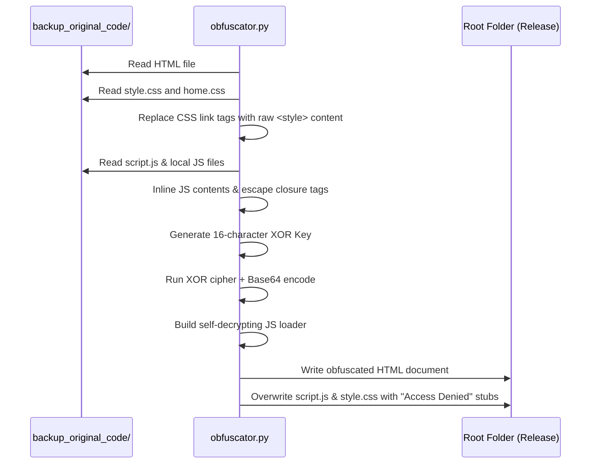

# 💻 Low Level Documentation (LLD) — SFI West Bengal Web Portal

This document provides a low-level engineering specification of the portal's interactive components, mathematical models, search indexer, and deployment encryption pipeline.

---

## 🌌 Mathematical Model: Vector Particle Field

The interactive background ([Particles](file:///c:/Users/rocks/OneDrive/Desktop/SFI/backup_original_code/script.js#L79-L224)) is drawn on an HTML5 Canvas using a 2D coordinate vector grid.

```xml
<svg xmlns="http://www.w3.org/2000/svg" viewBox="0 0 800 320" width="100%" style="background-color:#121214; border-radius:12px; font-family:'Segoe UI', sans-serif;">
  <!-- Grid -->
  <defs>
    <pattern id="lld-grid" width="30" height="30" patternUnits="userSpaceOnUse">
      <circle cx="15" cy="15" r="1" fill="rgba(255,255,255,0.05)"/>
    </pattern>
  </defs>
  <rect width="100%" height="100%" fill="#121214"/>
  <rect width="100%" height="100%" fill="url(#lld-grid)"/>

  <!-- Mouse Pointer -->
  <circle cx="400" cy="160" r="100" fill="none" stroke="#4d94ff" stroke-width="1" stroke-dasharray="4 4"/>
  <circle cx="400" cy="160" r="4" fill="#4d94ff"/>
  <text x="415" y="165" fill="#4d94ff" font-size="12" font-weight="bold">Mouse Cursor (X_m, Y_m)</text>
  <text x="415" y="180" fill="#a0a0a8" font-size="10">Active Area = 150px Radius</text>

  <!-- Particle Point -->
  <!-- Base Position -->
  <circle cx="280" cy="80" r="3" fill="#ff4d4d"/>
  <line x1="280" y1="80" x2="210" y2="50" stroke="#ff4d4d" stroke-width="1" stroke-dasharray="2 2"/>
  <circle cx="210" cy="50" r="4" fill="#ff4d4d"/>
  <text x="180" y="38" fill="#ff4d4d" font-size="11" font-weight="bold">Base Anchor (X_base, Y_base)</text>

  <!-- Displaced Vector -->
  <path d="M 280 80 Q 240 100 220 130" fill="none" stroke="#33cc33" stroke-width="1.5"/>
  <polygon points="220,130 222,122 227,126" fill="#33cc33"/>
  <text x="250" y="120" fill="#33cc33" font-size="11" font-weight="bold">Push Vector (F_push)</text>

  <!-- Rendered Dash Capsule -->
  <!-- Center is (x_p, y_p) -->
  <circle cx="210" cy="140" r="3" fill="#ffffff"/>
  <line x1="180" y1="110" x2="240" y2="170" stroke="#ffffff" stroke-width="3" stroke-linecap="round"/>
  <text x="245" y="165" fill="#ffffff" font-size="10">Rotated Capsule (Width W, Length L)</text>
  <text x="160" y="100" fill="#a0a0a8" font-size="9">Start (X_1, Y_1)</text>
  <text x="245" y="185" fill="#a0a0a8" font-size="9">End (X_2, Y_2)</text>

  <!-- Angle indicator -->
  <line x1="210" cy="140" x2="280" y2="140" stroke="#a0a0a8" stroke-width="0.75" stroke-dasharray="2 2"/>
  <path d="M 235 140 A 25 25 0 0 1 228 158" fill="none" stroke="#ffffff" stroke-width="1"/>
  <text x="240" y="152" fill="#ffffff" font-size="10">theta</text>

  <!-- Distance Indicator -->
  <line x1="400" y1="160" x2="210" y2="140" stroke="#4d94ff" stroke-width="1"/>
  <text x="300" y="165" fill="#4d94ff" font-size="10">Distance (d)</text>
</svg>
```

### 1. Grid Point Initialization & Color Spectrum
Particles are arranged in columns and rows spaced at equal intervals ($S = 32\text{px}$). At coordinate $(x_{\text{base}}, y_{\text{base}})$, the color spectrum is derived from its relative location to create a subtle chromatic gradient:

$$\text{Ratio}_x = \frac{x_{\text{base}}}{W_{\text{canvas}}}$$

$$\text{Ratio}_y = \frac{y_{\text{base}}}{H_{\text{canvas}}}$$

$$\text{Hue} = 40 + (1 - \text{Ratio}_x) \times 280 \times \text{Ratio}_y + \text{Ratio}_x \times 180 \times \text{Ratio}_y$$

This interpolates the particle color from gold/amber ($40^\circ$) to deep reds and cyan hues across the canvas.

### 2. Attraction / Repulsion Vector Math
For a particle at current coordinates $(x, y)$ and mouse cursor position $(x_m, y_m)$, the distance $d$ is:

$$d = \sqrt{(x - x_m)^2 + (y - y_m)^2}$$

If $d$ is less than the trigger radius ($D_{\max} = 150\text{px}$), a normalized force scalar $f$ is calculated:

$$f = \frac{D_{\max} - d}{D_{\max}} \quad \text{where } 0 \le f \le 1$$

The target displacement position $(x_{\text{target}}, y_{\text{target}})$ is calculated by applying a push force ($F_{\text{push}} = 40\text{px}$) along the unit vector from the mouse to the particle's base anchor:

$$x_{\text{target}} = x_{\text{base}} + \left(\frac{x_{\text{base}} - x_m}{d}\right) \times f \times F_{\text{push}}$$

$$y_{\text{target}} = y_{\text{base}} + \left(\frac{y_{\text{base}} - y_m}{d}\right) \times f \times F_{\text{push}}$$

### 3. Dynamic Rotation & Capsule Scaling
The line capsule rotates to align with the mouse repulsion vector:

$$\theta = \operatorname{atan2}(y - y_m, x - x_m) + \frac{\pi}{2}$$

The target line width and opacity scale with the force:

$$\text{Size}_{\text{target}} = 1.5 + f \times 2.2$$

$$\text{Opacity}_{\text{target}} = 0.14 + f \times 0.75 \quad \text{(Dark Theme)}$$

$$\text{Opacity}_{\text{target}} = 0.12 + f \times 0.65 \quad \text{(Light Theme)}$$

### 4. Interpolation Easing
To smooth out movement and prevent visual jittering, values are interpolated over time using linear easing at rate $E = 0.1$ per frame:

$$v_{\text{current}} = v_{\text{current}} + (v_{\text{target}} - v_{\text{current}}) \times E$$

This is applied to position coordinates, particle size, and opacity.

### 5. Drawing Capsule Coordinates
Given a capsule length scalar $L = 3 \times \text{Size}_{\text{current}}$, the capsule segment is defined by:

$$x_1 = x - L \cos(\theta), \quad y_1 = y - L \sin(\theta)$$

$$x_2 = x + L \cos(\theta), \quad y_2 = y + L \sin(\theta)$$

---

## 🔍 Detailed Script Analysis: build_search_system.py

This utility script creates a client-side search index ([search_data.js](file:///c:/Users/rocks/OneDrive/Desktop/SFI/search_data.js)) by parsing HTML files and raw datasets.

### `HTMLSearchIndexer` (Class)
Inherits from standard `html.parser.HTMLParser` to read HTML structures:
* **Properties**:
  * `text_content`: List of clean text fragments.
  * `headings`: List of heading strings (`<h1>` to `<h6>`).
  * `title`, `description`: Target metadata strings.
  * `in_script_or_style`, `in_header_nav_footer`, `in_title`, `in_heading`: Boolean flags used to ignore layout blocks and categorize text.
* **`handle_starttag(self, tag, attrs)`**:
  * Sets flags when entering tags (e.g., skips `<script>`, `<style>`, `<header>`, `<nav>`, `<footer>`).
  * If the tag is `<meta name="description">`, extracts the value of the `content` attribute.
* **`handle_endtag(self, tag)`**:
  * Resets state flags.
  * For headings, joins individual characters and appends the result to `self.headings`.
* **`handle_data(self, data)`**:
  * Appends text to `self.text_content` after replacing multiple whitespace characters with a single space.
* **`handle_entityref(self, name)` / `handle_charref(self, name)`**:
  * Resolves HTML entities (e.g., `&amp;` or unicode values) into plain characters, routing them to the correct collector based on state flags.

### `parse_js_data(filepath, var_name)`
Parses datasets structured as JavaScript assignments (e.g., `const martyrsData = [...]`) without executing the file:
* Reads file content.
* Uses regular expressions to match the target array definition:
  `var_name + r'\s*=\s*(\[.*\]);?'`
* Strips trailing commas inside objects/arrays using regex: `re.sub(r',\s*([\]}])', r'\1', json_str)` to ensure it parses as valid JSON.
* Decodes the string using `json.loads()` and returns the resulting Python list.

### `build_index()`
Main execution loop:
1. Iterates over HTML files inside `backup_original_code/`.
2.Feeds page content to `HTMLSearchIndexer`, compiles results, and maps key fields (URL, Title, Description, Headings, and Content).
3. Parses `martyrs_data.js` and extracts record attributes (Name, English Name, Description, Year, State). Constructs search objects mapping to URL queries (e.g., `martyrs.html?id=ID`).
4. Parses `press_data.js` and extracts news attributes (ID, Title, Intro, Date, Tags) to construct search objects (e.g., `press.html?id=ID`).
5. Serializes the combined list of search objects to `search_data.js` as a global JavaScript array: `const searchData = [...]`.

---

## 🔒 Security Pipeline: obfuscator.py

This script processes pages inside the source directory, inlines local styles, and encrypts document bodies.



### Encryption Mechanics: `xor_encrypt(content, key)`
Applies a symmetric XOR cipher to the raw HTML body:
* Iterates through the byte representation of the content:
  ```python
  encrypted_bytes.append(content_bytes[i] ^ key_bytes[i % len(key_bytes)])
  ```
* Encodes the resulting byte array using Base64.
* Returns the encrypted string.

### HTML Processor: `obfuscate_html_file(file_path)`
1. Read the clean HTML page.
2. Inlines stylesheet files (`style.css`, `home.css`) by replacing matching `<link href="...">` tags with raw `<style>` tags containing their contents.
3. Inlines local scripts using regex to replace matching `<script src="...">` tags with raw script content. It escapes any internal `</script>` tags as `<\/script>`.
4. Extracts the body content using the regular expression:
   `(<body[^>]*>)(.*?)(</body>)`
5. Generates a random 16-character alphanumeric key.
6. Encrypts the extracted body content with `xor_encrypt`.
7. Wraps the encrypted string inside a JavaScript bootloader:
   ```javascript
   (function(_payload, _key) {
       var decoded = atob(_payload);
       var decrypted = "";
       var keyLen = _key.length;
       for (var i = 0; i < decoded.length; i++) {
           decrypted += String.fromCharCode(decoded.charCodeAt(i) ^ _key.charCodeAt(i % keyLen));
       }
       document.write(decodeURIComponent(escape(decrypted)));
   })("ENCRYPTED_BASE64_STRING", "RANDOM_KEY");
   ```
8. Writes the modified HTML structure (retaining head data and inserting the bootloader in the body) back to the root folder.

---

## 🕹️ Frontend Control Systems: script.js

The client-side interface ([script.js](file:///c:/Users/rocks/OneDrive/Desktop/SFI/backup_original_code/script.js)) coordinates user interactions and visual animations.

### 1. `ThemeManager`
* **`init()`**: Reads `sfi-theme` from `localStorage` (defaulting to `dark`), applies the theme, and attaches click listeners to elements matching `#themeToggle`.
* **`apply(theme)`**: Sets the `data-theme` attribute on the root `<html>` element, updates icon classes (between `fa-sun` and `fa-moon`), and updates logo visibility. Saves the state back to `localStorage`.

### 2. `HeroSlider`
Manages slide transitions:
* **Autoplay**: Sets an interval (`5000ms`) to trigger `next()`.
* **`goTo(index)`**: Toggles active classes on slides and navigation dots.
* **Touch Events**: Listens for `touchstart` and `touchend` events to calculate horizontal swipe distances ($\Delta X$). If $\Delta X > 50\text{px}$, it triggers slide changes and resets the autoplay timer.

### 3. `ContactForm`
Validates and processes contact form submissions:
* Prevents the default submit action.
* Compares user input with the static CAPTCHA string ("R7P9").
* If verification fails, it adds a visual shake animation to the input border and alerts the user.
* If verification succeeds, it disables the submit button, updates button text to a loading state, simulates an asynchronous transmission delay (`1500ms`), and displays a success confirmation.
